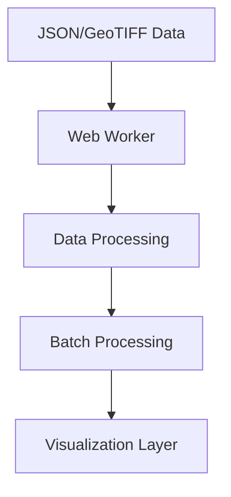

# Spinachh
A React-based web application for visualizing geographical stress data using interactive heatmaps and markers. The application processes GeoJSON and Cloud-Optimized GeoTIFF (COG) data to create intuitive visualizations of stress patterns across different locations.

## Features

- Interactive heatmap visualization
- Real-time stress data processing
- High-performance data handling with Web Workers
- Customizable stress thresholds
- Zoom and pan controls
- Stress hotspot identification
- Statistical overview panel

##  Data Flow & Architecture

### 1. Data Loading Pipeline

