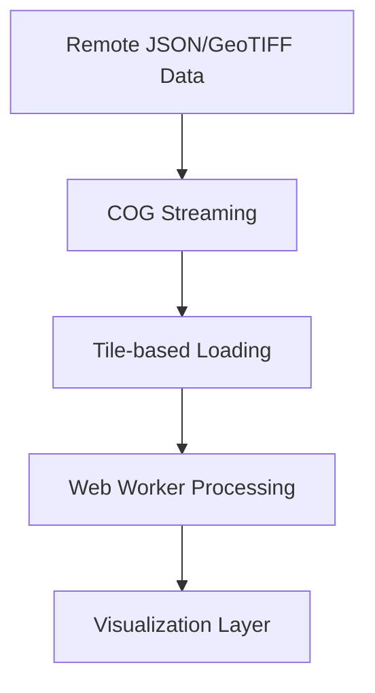

# Spinachh
A React-based web application for visualizing geographical stress data using interactive heatmaps and markers. The application processes GeoJSON and Cloud-Optimized GeoTIFF (COG) data to create intuitive visualizations of stress patterns across different locations.

## Features

- Interactive heatmap visualization
- Real-time stress data processing
- High-performance data handling with Web Workers
- Customizable stress thresholds
- Zoom and pan controls
- Stress hotspot identification
- Statistical overview panel
- Optimized remote data loading with COG streaming
- Dynamic tile loading based on viewport

##  Data Flow & Architecture

### 1. Data Loading Pipeline


1. **Initial Data Loading**
   - Loads GeoJSON data from `sample_data/stress_sample.json`
   - Processes Cloud-Optimized GeoTIFF files
   - Validates data structure and format

2. **Data Processing**
   - Web Worker handles heavy computation
   - Chunks data for efficient processing
   - Normalizes values to 0-255 range
   - Filters invalid data points

3. **Visualization Preparation**
   - Converts coordinates to map points
   - Calculates stress intensity
   - Prepares heatmap data layer
   - Creates marker data for hotspots

### 2. Map Component Workflow

```javascript
// Key configuration
const STRESS_THRESHOLD = 0.7;  // High stress threshold
const GRID_CELL_SIZE = 20;     // Grid resolution in cm
```

1. **Map Initialization**
   - Sets up Leaflet map instance
   - Configures initial bounds and zoom
   - Prepares layer containers

2. **Heatmap Layer**
   - Configures heatmap settings
   - Applies color gradient
   - Handles zoom levels
   - Updates on data changes

3. **Marker Management**
   - Batch processes markers
   - Implements efficient rendering
   - Handles marker cleanup

## 📦 Data Sources

The application uses the following remote data sources:

1. **Stress Sample Data**
   - Primary: `stress_sample.json`
   - Secondary: `stress_sample_2.json`
   - Format: GeoJSON
   - Contains: NDVI values and polygon geometries

2. **GeoTIFF Data**
   - File: `sample.tiff`
   - Format: Cloud-Optimized GeoTIFF (COG)
   - Resolution: Multiple overview levels
   - Streaming: Enabled for efficient loading

## 🔧 Configuration

### Remote Data URLs
```javascript
const DATA_URLS = {
  STRESS_SAMPLE: 'https://drive.google.com/uc?export=download&id=1bSGUpQ7BH63sz9gzUGnd3xb-n2hoDwyz',
  STRESS_SAMPLE_2: 'https://drive.google.com/uc?export=download&id=1vxhgJLAmfK7o-IfQMUKeVsZTW1RqVw7N',
  SAMPLE_TIFF: 'https://drive.google.com/uc?export=download&id=1oEZ9EBMogfB_8c2WHfW5GPjVJIo5hKNj'
};
```

### COG Loading Configuration
```javascript
const COG_CONFIG = {
  initialBytes: 16384,  // Initial header request size
  maxRequestsPerTile: 4,  // Concurrent request limit
  enableStreaming: true   // Enable COG streaming
};
```

********