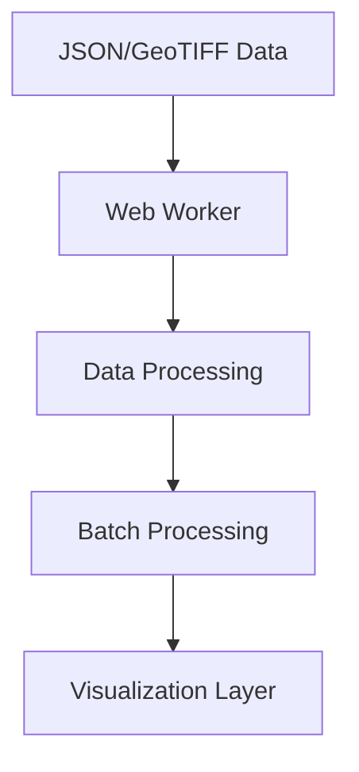

# Stress Data Visualization Application 🌍

A React-based web application for visualizing geographical stress data using interactive heatmaps and markers. The application processes GeoJSON and Cloud-Optimized GeoTIFF (COG) data to create intuitive visualizations of stress patterns across different locations.

## 🚀 Features

- Interactive heatmap visualization
- Real-time stress data processing
- High-performance data handling with Web Workers
- Customizable stress thresholds
- Zoom and pan controls
- Stress hotspot identification
- Statistical overview panel

## 📊 Data Flow & Architecture

### 1. Data Loading Pipeline


1. **Initial Data Loading**
   - Loads GeoJSON data from `sample_data/stress_sample.json`
   - Processes Cloud-Optimized GeoTIFF files
   - Validates data structure and format

2. **Data Processing**
   - Web Worker handles heavy computation
   - Chunks data for efficient processing
   - Normalizes values to 0-255 range
   - Filters invalid data points

3. **Visualization Preparation**
   - Converts coordinates to map points
   - Calculates stress intensity
   - Prepares heatmap data layer
   - Creates marker data for hotspots

### 2. Map Component Workflow

```javascript
// Key configuration
const STRESS_THRESHOLD = 0.7;  // High stress threshold
const GRID_CELL_SIZE = 20;     // Grid resolution in cm
```

1. **Map Initialization**
   - Sets up Leaflet map instance
   - Configures initial bounds and zoom
   - Prepares layer containers

2. **Heatmap Layer**
   - Configures heatmap settings
   - Applies color gradient
   - Handles zoom levels
   - Updates on data changes

3. **Marker Management**
   - Batch processes markers
   - Implements efficient rendering
   - Handles marker cleanup

## 🛠 Technical Implementation

### Performance Optimizations

1. **Data Processing**
   ```javascript
   // Web Worker implementation
   const worker = createWorker();
   worker.postMessage({ chunk: dataChunk });
   ```
   - Offloads heavy computation
   - Processes data in chunks
   - Updates progress in real-time

2. **Rendering Pipeline**
   - Uses Canvas rendering
   - Implements batch processing
   - Optimizes marker creation
   - Manages memory efficiently

### Memory Management

1. **Resource Cleanup**
   ```javascript
   useEffect(() => {
     return () => {
       // Cleanup code
       worker?.terminate();
       clearLayers();
     };
   }, []);
   ```

2. **Layer Management**
   - Proper layer disposal
   - Memory leak prevention
   - Efficient data structure updates


## 🔧 Setup and Installation

1. **Clone the Repository**
   ```bash
   git clone https://github.com/yourusername/stress-visualization.git
   cd stress-visualization
   ```

2. **Install Dependencies**
   ```bash
   npm install
   ```

3. **Run Development Server**
   ```bash
   npm start
   ```

## 📦 Dependencies

- React
- Leaflet
- heatmap.js
- GeoTIFF.js
- Web Workers API

## 🔍 Usage

1. **Loading Data**
   ```javascript
   // Load stress data
   const data = await loadStressData('sample_data/stress_sample.json');
   ```

2. **Configuring Visualization**
   ```javascript
   // Update heatmap settings
   const heatmapConfig = {
     radius: 12,
     blur: 8,
     maxZoom: 20
   };
   ```

3. **Accessing Statistics**
   - Use StressOverview component
   - Monitor high-stress areas
   - Track stress patterns
